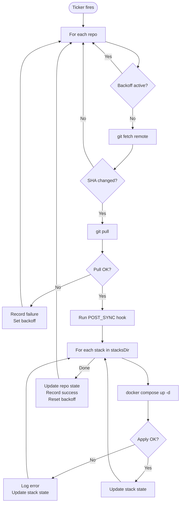

# Architecture

stackd is a lightweight GitOps daemon: a **git poller** that detects changes, a **compose runner** that applies those changes, and a **web dashboard** that exposes state and enables manual control.

---

## Overview

stackd runs as a single Go binary inside a Docker container. At startup it sets up SSH, connects to the Docker daemon, scans for existing managed containers, and starts an HTTP server. A main sync loop then polls each configured repository on a fixed interval, pulling changes and applying Docker Compose stacks when the HEAD SHA changes.

There is no database. All state is held in memory and rebuilt from Docker on restart. The HTTP API exposes this state and lets the dashboard trigger on-demand syncs.

---

## Startup Sequence

1. **Logging initialised** — format (`json`/`text`) and level (`debug`/`info`/`warn`/`error`) applied from env vars
2. **SSH setup** — `ssh-keyscan github.com` writes `known_hosts`; SSH config and `GIT_SSH_COMMAND` are set
3. **State store initialised** — empty in-memory `sync.RWMutex`-protected store created
4. **Docker client connected** — connects to `/var/run/docker.sock`; stackd can still run (degraded) if Docker is unavailable
5. **Repo list built** — directories under `REPOS_DIR` are discovered; per-repo config merged from env vars and `stackd.yaml`
6. **Existing containers scanned** — running containers are matched to known stacks so the dashboard shows state immediately
7. **HTTP server started** — dashboard, API, health probes, and metrics endpoints begin serving
8. **Main sync loop started** — ticker fires every `SYNC_INTERVAL_SECONDS` seconds; manual sync channel is also monitored

---

## Sync Loop



Manual sync requests from `POST /api/sync/{repo}` skip the ticker and inject the repo name directly into the sync channel, resetting any active backoff first.

---

## Per-Repo Backoff

When a sync fails, stackd backs off exponentially to avoid hammering a broken git remote or Docker daemon.

The backoff is tracked per repo in a `syncBackoff` struct:

| Field | Description |
|---|---|
| `failures` | Consecutive failure count since last success |
| `nextAllowed` | Earliest time the next sync is permitted |
| `suspended` | Set to `true` after `maxSyncFailures` (10) consecutive failures |

**Backoff formula:**

```
delay = 2^failures × syncInterval
delay = min(delay, 8 × syncInterval)
```

| Failures | Delay (60s interval) |
|---|---|
| 1 | 2 min |
| 2 | 4 min |
| 3 | 8 min |
| 4+ | 8 min (capped) |
| 10 | Suspended — manual sync required |

A **manual sync** (`POST /api/sync/{repo}`) resets the backoff and unsuspends the repo immediately.

On any successful sync, the failure counter and backoff are reset.

---

## State Store

The state store is a simple in-memory structure protected by `sync.RWMutex`. It holds:

- **`repos`** — map of repo name → `RepoState` (last SHA, sync status, last error)
- **`stacks`** — map of `repoName/stackName` → `StackState` (apply status, container details)
- **`infisical`** — global `InfisicalState` (enabled flag, environment name)

There is **no persistence**. On restart, repo and stack states are reconstructed by scanning running Docker containers. This means:

- `lastSync` and `lastSha` are unknown until the first successful sync after restart
- Container details are immediately available because they are read from Docker on startup
- No database migrations, no corruption risk

---

## HTTP Server

The server uses Go's standard `net/http` with a middleware chain applied to every request:

```
Request
  └── securityHeaders        (X-Content-Type-Options, X-Frame-Options, Referrer-Policy)
        └── authMiddleware   (bearer token check for /api/* paths)
              └── rateLimiter (per-repo window on POST /api/sync/{repo})
                    └── handler (mux)
```

**Server-Sent Events (SSE)** for log streaming: `GET /api/logs/{container}` holds the HTTP connection open and flushes each Docker log line as `data: <line>\n\n`. nginx buffering is disabled via `X-Accel-Buffering: no`.

**Timeouts:**
- `ReadTimeout`: 30 seconds
- `WriteTimeout`: disabled (required for SSE streams)
- `IdleTimeout`: 60 seconds
- Graceful shutdown: 10 seconds

---

## Configuration Precedence

```
Environment variables   (highest priority)
       ↓
  stackd.yaml
       ↓
 Built-in defaults      (lowest priority)
```

This allows a base `stackd.yaml` to define repo structure while environment variables override individual settings at runtime without modifying the config file.
