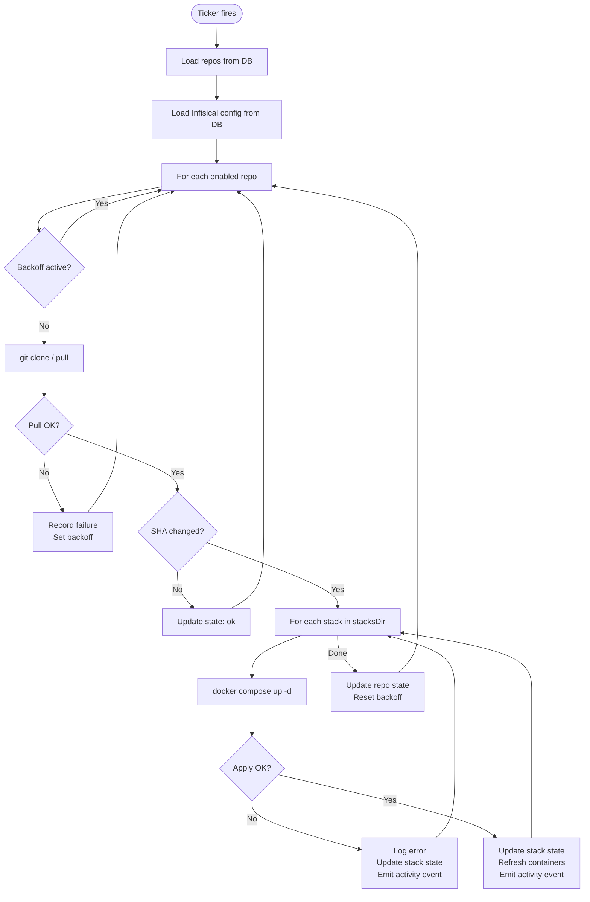

# Architecture

stackd is a lightweight GitOps daemon: a **git poller** that detects changes, a **compose runner** that applies those changes, and a **web dashboard** that exposes state and enables manual control.

---

## Overview

stackd runs as a single Go binary inside a Docker container. At startup it initialises a SQLite (or PostgreSQL) database, sets up SSH, connects to the Docker daemon, performs an initial sync of all configured repositories, and starts an HTTP server. A main sync loop then polls each configured repository on its configured interval, pulling changes and applying Docker Compose stacks when the HEAD SHA changes.

**Two stores are in use simultaneously:**

- **SQLite/PostgreSQL database** — persistent; holds repository configuration, SSH keys, Infisical credentials, and settings. Survives restarts. Managed through the Settings UI.
- **In-memory state store** — holds live stack status, container details, and sync outcomes. Rebuilt on every restart by re-syncing all repos and scanning Docker.

---

## Startup Sequence

1. **Logging initialised** — format (`json`/`text`) and level (`debug`/`info`/`warn`/`error`) applied from env vars
2. **Database opened** — SQLite file or PostgreSQL connection; schema migrations applied automatically
3. **Crypto key derived** — `SECRET_KEY` is stretched into a 32-byte AES key used for encrypting stored secrets
4. **SSH setup** — `ssh-keyscan github.com` writes `known_hosts`; SSH config and `GIT_SSH_COMMAND` are set
5. **State store initialised** — empty in-memory `sync.RWMutex`-protected store created; Infisical state loaded from DB
6. **Docker client connected** — connects to `/var/run/docker.sock`; stackd can still run (degraded) if Docker is unavailable
7. **Startup sync** — all enabled repos from the database are synced immediately so the dashboard shows real state from the first request
8. **HTTP server started** — dashboard, API, health probes, and metrics endpoints begin serving
9. **Main sync loop started** — ticker fires every `syncInterval` seconds; manual sync channel is also monitored

---

## Sync Loop



Manual sync requests from `POST /api/sync/{repo}` skip the ticker and inject the repo name directly into the sync channel, resetting any active backoff first.

Per-stack apply requests (`POST /api/stacks/{repo}/{stack}/apply`) pull the repo then apply only the target stack.

---

## Per-Repo Backoff

When a sync fails, stackd backs off exponentially to avoid hammering a broken git remote or Docker daemon.

The backoff is tracked per repo in a `syncBackoff` struct:

| Field | Description |
|---|---|
| `failures` | Consecutive failure count since last success |
| `nextAllowed` | Earliest time the next sync is permitted |
| `suspended` | Set to `true` after 10 consecutive failures |

**Backoff formula:**

```
delay = 2^failures × syncInterval
delay = min(delay, 8 × syncInterval)
```

| Failures | Delay (60s interval) |
|---|---|
| 1 | 2 min |
| 2 | 4 min |
| 3 | 8 min |
| 4+ | 8 min (capped) |
| 10 | Suspended — manual sync required |

A **manual sync** (`POST /api/sync/{repo}`) resets the backoff and unsuspends the repo immediately.

On any successful sync, the failure counter and backoff are reset.

---

## State Store

The in-memory state store is protected by `sync.RWMutex`. It holds:

- **`repos`** — map of repo name → `RepoState` (last SHA, sync status, last error)
- **`stacks`** — map of `repoName/stackName` → `StackState` (apply status, container details, Infisical mode)
- **`infisical`** — global `InfisicalState` (enabled flag, environment name)

This state is **not persisted** — it is rebuilt on every restart via the startup sync. This means:

- `lastSync` and `lastSha` reflect the first sync after startup, not historical history
- Container details are available immediately because they are read from Docker on startup
- No migration risk; no corruption possible

Persistent configuration (repos, SSH keys, tokens) lives in the database — see [Database](database.md).

---

## HTTP Server

The server uses Go's standard `net/http` with a middleware chain applied to every request:

```
Request
  └── securityHeaders        (X-Content-Type-Options, X-Frame-Options, Referrer-Policy)
        └── authMiddleware   (bearer token check for /api/* paths; ?token= for WebSocket)
              └── rateLimiter (per-repo window on POST /api/sync/{repo})
                    └── handler (mux)
```

**Server-Sent Events (SSE)** for log streaming and activity feed: the HTTP connection is held open and each event is flushed as `data: <payload>\n\n`. nginx buffering is disabled via `X-Accel-Buffering: no`.

**WebSocket** for the web shell: `GET /api/exec/{container}` upgrades to WebSocket and bridges a `docker exec` PTY session, with a 30-minute session timeout.

**Timeouts:**
- `ReadTimeout`: 30 seconds
- `WriteTimeout`: disabled (required for SSE streams and WebSocket)
- `IdleTimeout`: 60 seconds
- Graceful shutdown: 10 seconds (30 second drain for in-flight sync operations)

---

## Activity Bus

A lightweight fan-out pub/sub bus (`ActivityBus`) publishes events when repos are pulled and stacks are applied. Any number of SSE clients subscribed to `GET /api/activity` receive these events in real time. Slow subscribers have events dropped (non-blocking send) to prevent back-pressure.

---

## Configuration Precedence

```
Environment variables   (highest priority)
       ↓
  Database / Settings UI
       ↓
 Built-in defaults      (lowest priority)
```

The `DASHBOARD_TOKEN` env var overrides the token stored in the database. All other configuration (repos, SSH keys, Infisical) is DB-only with no env var equivalent.
```

---